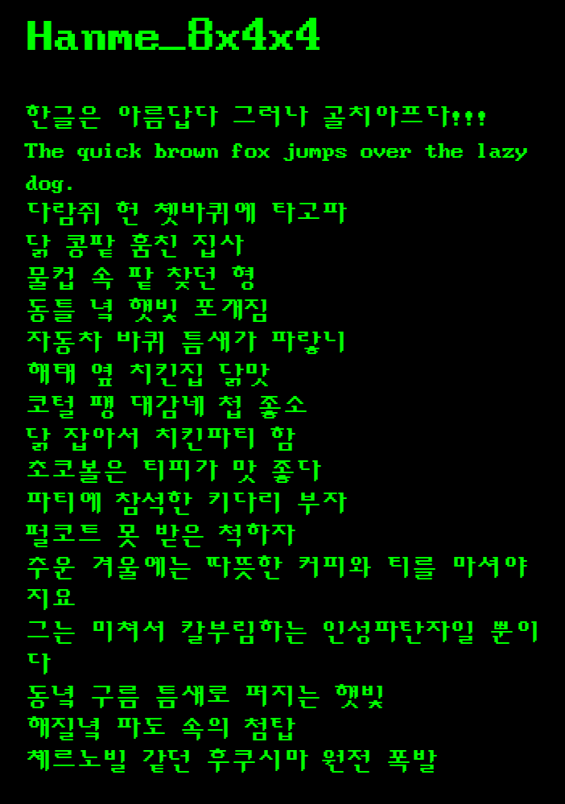
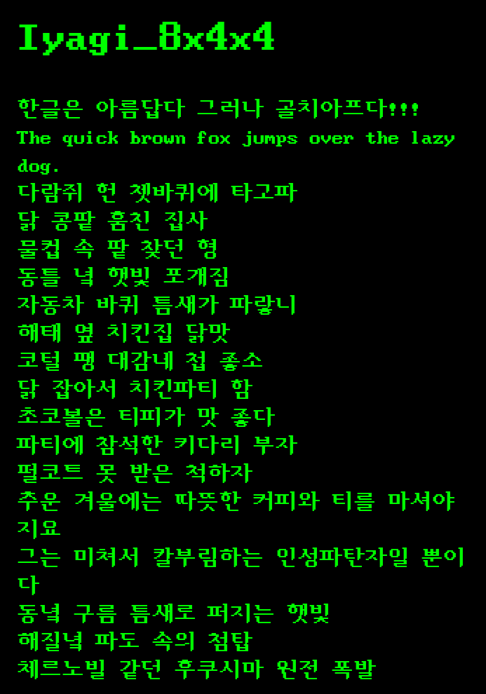
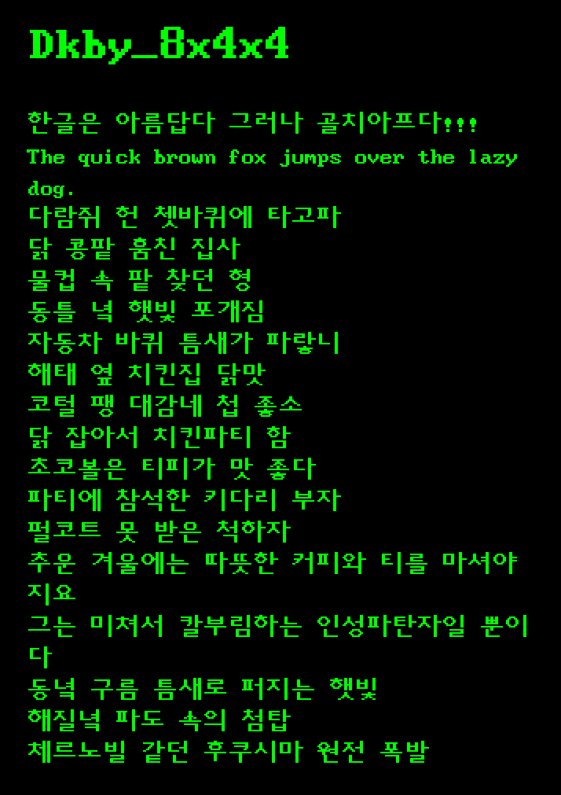
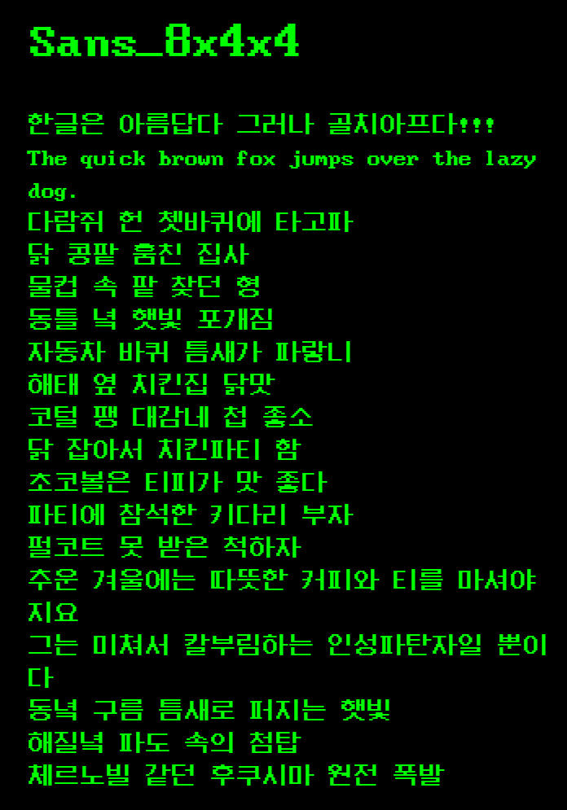
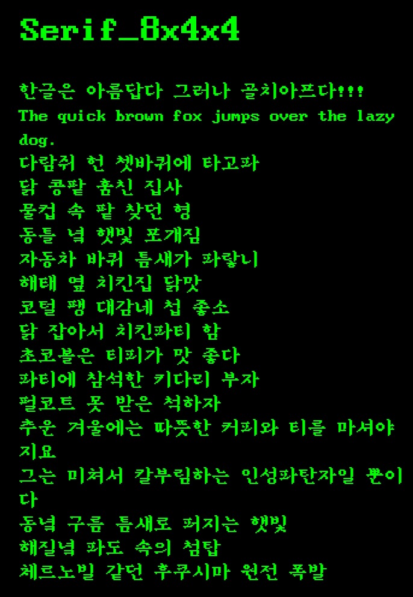

8x4x4-fonts
===========

구닥다리 8x4x4(영문 8x16, 한글 16x16) 조합 글꼴 ttf 변환기 & 글꼴 모음

- 한글 초성 8벌, 중성 4벌, 종성 4벌로 이루어진 조합형 글꼴. 그래서 8x4x4.
- IBM-PC XT/AT의 MS-DOS용 프로그램에서 많이 사용되었고, 글립의 크기는 16x16 픽셀이며,
- 허큘리스 변형 그래픽 모드(640x400)에서 한 화면에 한글 40자x24줄(영문 80자x24줄)을 표시할 수 있었음.
- VGA 표준 그래픽 모드(640x480)에서 한 화면에 40자x30줄(영문 40자x30줄)를 표시할 수 있었음.

## 조합 규칙

- 초성1: 세로모음, 종성없음
- 초성2: 가로모음ㅗㅛㅡ 종성없음
- 초성3: 가로모음ㅜㅠ 종성없음
- 초성4: 복모음ㅘㅙㅚㅢ 종성없음
- 초성5: 복모음ㅝㅞㅟ 종성있음
- 초성6: 세로모음 종성있음
- 초성7: 가로모음 종성있음
- 초성8: 복모음 종성있음
- 중성1: 초성ㄱㅋ 종성없음
- 중성2: 초성나머지ㅍ 종성없음
- 중성3: 초성ㄱㅋ 종성있음
- 중성4: 초성나머지 종성있음
- 종성1: 모음ㅏㅑㅘ
- 종성2: 모음ㅓㅕㅚㅝㅟㅢㅣ
- 종성3: 모음ㅐㅒㅔㅖㅙㅞ
- 종성4: 모음ㅗㅛㅜㅠㅡ

## 글꼴

## 참고

- [6x2x1-fonts](https://github.com/iolo/6x2x1-fonts)
- [7x12-fonts](https://github.com/iolo/7x12-fonts)

---
May the **SOURCE** be with you...
